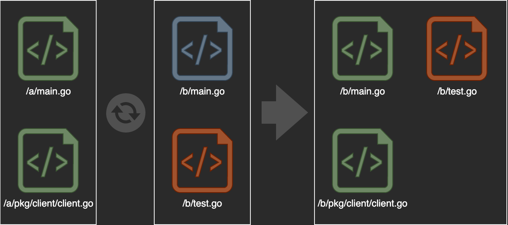
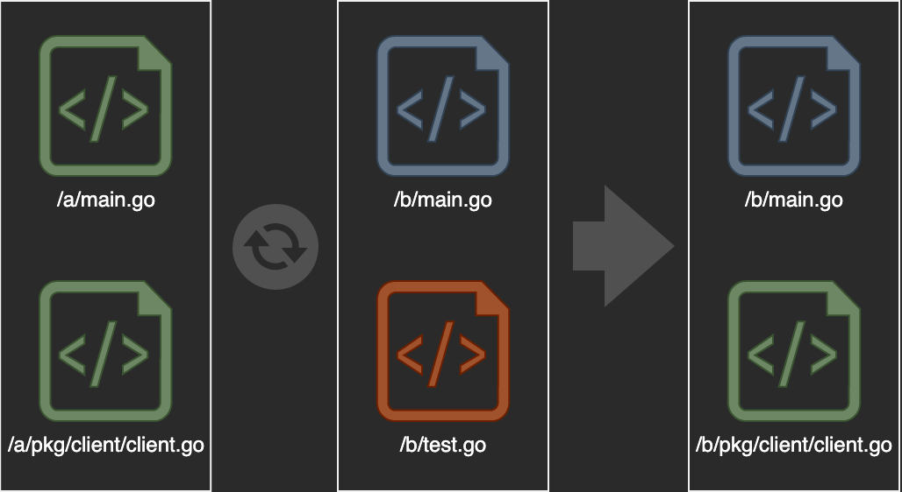
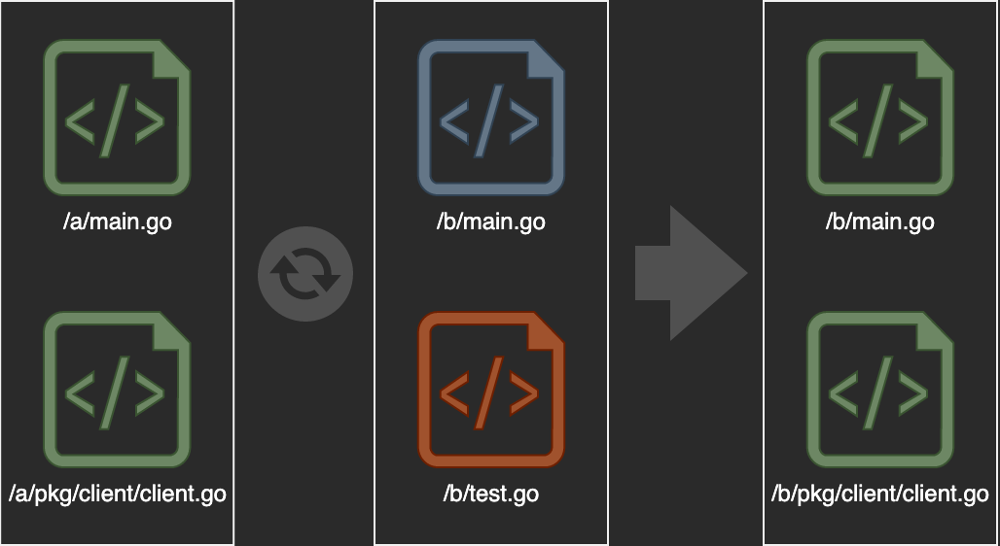

# dtsync
`dtsync` is a flexible file synchronization tool designed to keep your directories in sync. 
It provides a simple command-line interface that allows you to specify source and destination directories, and offers options to remove or replace files. Whether you're managing backups, mirroring directories, or simply moving files around, dtsync can support you.

## Usage
Currently supported arguments can be listed as follow.
```bash
$ ./dtsync -help
Usage of dtsync:
  -src string
        The source root path (required)
  -dst string
        The destination root path (required)
  -remove
        Remove files and directories in dst not included in src
  -replace
        Replace file on dst when different
```

### Default Case
```bash
$ ./dtsync -src /a -dst /b
```


### Case With Replace
```bash
$ ./dtsync -src /a -dst /b -replace
```


### Case With Remove
```bash
$ ./dtsync -src /a -dst /b -remove
```


### Case With Replace And Remove
```bash
$ ./dtsync -src /a -dst /b -replace -remove
```


### Disclaimer
`dtsync` is provided "as is", without warranty of any kind. 
The authors or copyright holders will not be liable for any damage, data loss, or any other issue that may occur as a result of using this tool. 
Use at your own risk.